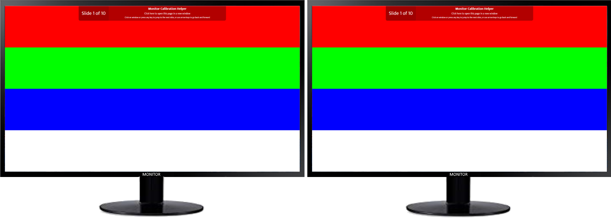

# react-monitor-calibration
A simple app to display slides of color patterns to help you calibrate multiple monitors.  Written in React as a sample project.

## How to use
Open the browser page on multiple monitors and hit F11 to go full screen.  Now when you click on each slide, the multiple pages should all be synchronised.

Having these images side by side will hopefully let you calibrate your monitors, either by using the manual settings on the monitor itself or by using your graphics card utility to adjust the various parameters.

## What?  I have to manually calibrate my monitors?!
Yep, this software is not smart enough to do it for you ;)
