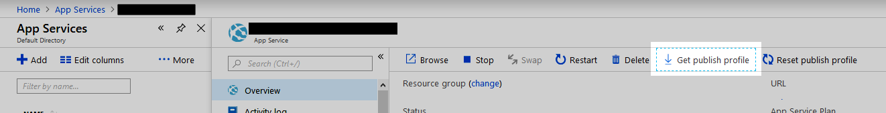

# Deployment using Kudu

Instructions from: https://github.com/projectkudu/kudu/wiki/Deploying-from-a-zip-file

To deploy the content of a zip file to your site, POST the zip to /api/zipdeploy.

Using curl:

curl -X POST -u <user> --data-binary @<zipfile> https://{sitename}.scm.azurewebsites.net/api/zipdeploy

zipdeploy is intended for fast and easy deployments from development environments, as well as deployment of ready-to-run sites built by continuous integration services such as Visual Studio Team Services. Unlike other Kudu deployment mechanisms, Kudu assumes by default that deployments from zip files are ready to run and do not require additional build steps during deployment, such as npm install or dotnet restore/dotnet publish

## Notes

The build script expects two files to be present in the deploy folder.  Because these two files contains sensitive data it should never be checked into source control, and hence is masked from Git via the .gitignore file.

### config.json
Contains details about the web app in Azure (resource group and web app name).

```
{
  "webappname": "YourWebAppName",
  "resourceGroup": "YourWebAppResourceGroup",
  "location": "Central US (or whatever region your app resource group is in"
}
```

### publishsettings.xml
Contains details to access your web app in Azure.  You can get this file by clicking the Get Publish Profile link in the Azure portal for your web app:



Download it and copy to the `deploy` folder with the name `publishsettings.xml`.

Example contents:

```
<?xml version="1.0" encoding="utf-8"?>
<publishData>
  <publishProfile profileName="YourWebApp - Web Deploy" publishMethod="MSDeploy" publishUrl="yourwebapp.scm.azurewebsites.net:443" msdeploySite="YourWebApp" userName="$YourWebAppUserName" userPWD="thepassword" destinationAppUrl="http://yourwebapp.azurewebsites.net" SQLServerDBConnectionString="" mySQLDBConnectionString="" hostingProviderForumLink="" controlPanelLink="http://windows.azure.com" webSystem="WebSites">
    <databases />
  </publishProfile>
</publishData>
```
